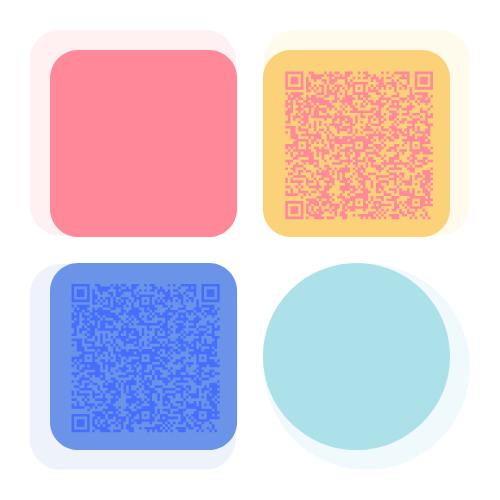

<h1 align="center">
  
  Elizabete De Sousa Fabri
</h1>

  <b>Software Engineer | Platform Engineering | DevSecOps | Cloud & Front-End</b> 
  <i style="color:#999;">Apaixonada por tecnologia, automação e soluções em Cloud ☁️</i>

### 🌸 Sobre mim

Sou <b>Engenheira de Software no Itaú Unibanco</b>, apaixonada por tecnologia, automação e soluções em Cloud.  
Atuo com foco em <b>Plataformas, DevSecOps e Engenharia de Software</b>, unindo performance, segurança e inovação.  
No tempo livre, gosto de criar interfaces intuitivas e explorar projetos pessoais em Angular, Next.js e AWS.

### 💬 Conecte-se comigo

  
  
  
  

<h2>⚡ Tech Stack</h2>

  <!-- Cloud e DevOps -->
  
  
  
  
  
  
  
  
  
  
  <!-- Testes e Performance -->
  
  
  
  <!-- Linguagens -->
  
  
  
  
  
  
  <!-- Frameworks e Front-End -->
  
  
  
  
  <!-- Ferramentas e Outros -->
  
  
  
  
  
  
  
  
  
  
  

### 📊 GitHub Analytics

  
  

  <i>"Nada substitui a persistência, nem mesmo o talento." — Calvin Coolidge</i>

