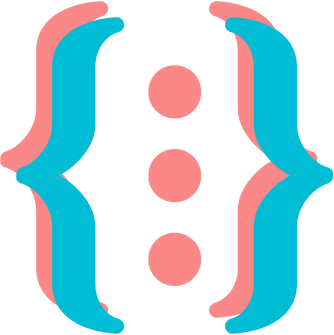

<h1>
    
    Elizabete Fabri
</h1>

Hello, I'm Elizabete de Sousa Fabri, graduated in Internet Systems. 
I've been in the field of technology since 2019, when I performed my first "Hello World" with Javascript. 
I have a passion for arts and technology, and I try to keep up to date with the latest trends in the industry.  
My goal is to provide innovative solutions to my clients, always focusing on clean code and adding value to their products at every stage.

##

<h3 align="left">Connect with me</h3>

<h3 align="left">GitHub Stats</h3>
  

  </a>

<!-- FOOTER -->

"Nada substitui a persistência, nem mesmo o talento." CALVIN COOLIDGE. 
