<h1 align="left">
  
  Elizabete De Sousa Fabri
</h1>

  <b>Software Engineer | Platform Engineering | DevSecOps | Cloud & Front-End</b> 
  <i style="color:#999;">Passionate about technology, automation, and Cloud solutions ☁️</i>

### 🌸 About Me

I’m a **Software Engineer at Itaú Unibanco**, passionate about technology, automation, and Cloud-native solutions.  
I work with a strong focus on **Platform Engineering, DevSecOps, and Software Engineering**, combining performance, security, and innovation.  
In my free time, I enjoy building intuitive interfaces and exploring personal projects using Angular, Next.js, and AWS.

✨ **Explore My Professional & Personal Portfolio**

> Discover my personal platform, where I showcase professional projects, personal initiatives, and my journey in Software Engineering, Platform Engineering, and Cloud technologies.

**Portfolio:** https://elizabetesousafabri.com.br/

  

### Connect with Me

  <!-- LinkedIn -->
  
  
  
  
  

 

  

### Tech Stack

  
  
  
  
  
  

 

  

### Base de Estudos & Aprendizado Contínuo

> Repositórios voltados ao aprendizado contínuo, organização de conhecimento e planejamento de evolução técnica, incluindo estudos, certificações e materiais de referência.

<table>
  <thead>
    <tr align="left">
      <th>º</th>
      <th>Projeto</th>
      <th>Stack</th>
      <th>Descrição</th>
      <th>Repositório</th>
      <th>Deploy</th>
    </tr>
  </thead>
  <tbody align="left">
    <tr>
      <td>📒</td>
      <td align="center"><b>Acervo de Estudos e Aprendizado Contínuo</b></td>
      <td>PDF · Docs</td>
      <td>Repositório com livros e materiais em PDF destinados a estudos, aprofundamento técnico e evolução contínua em engenharia de software.</td>
      <td align="center">
        
      </td>
      <td align="center">-</td>
    </tr>
   <tr>
      <td>🎯</td>
      <td align="center"><b>Roadmap de Certificações e Estudos Técnicos</b></td>
      <td>Docs · Markdown · Study Plan</td>
      <td>Projeto pessoal com documentações, exercícios e guias práticos sobre como se preparar e conquistar certificações em engenharia de software e cloud.</td>
      <td align="center">
        
      </td>
      <td align="center">
        
      </td>
    </tr>
  </tbody>
</table>

### Portfólio de Projetos em Destaque

> Projetos que representam minha evolução técnica, foco em Frontend, Platform Engineering, Cloud e boas práticas de engenharia de software.

<table>
  <thead>
    <tr align="left">
      <th>º</th>
      <th>Projeto</th>
      <th>Descrição</th>
      <th>Repositório</th>
      <th>Portfólio</th>
    </tr>
  </thead>
  <tbody>
    <!-- Portfólio Pessoal -->
    <tr>
      <td>✨</td>
      <td align="center"><b>Portfólio Pessoal</b></td>
      <td>
        Espaço dedicado a projetos pessoais, estudos, experimentações técnicas
        e iniciativas criativas desenvolvidas ao longo da minha jornada.
      </td>
      <td align="center">
        
      </td>
      <td align="center">
        
      </td>
    </tr>
    <!-- Portfólio Profissional -->
    <tr>
      <td>✨</td>
      <td align="center"><b>Portfólio Profissional</b></td>
      <td>
        Portfólio focado em projetos profissionais, experiências corporativas,
        soluções técnicas e evolução na engenharia de software.
      </td>
      <td align="center">
        
      </td>
      <td align="center">
        
      </td>
    </tr>
  </tbody>
</table>

  

<!-- ### 🎓 Certification

  <table>
    <tr>
      <td align="center">
        
      </td>
      <td align="center">
        <a href="https://www.credly.com/users/elizabetefabri" target="_blank">
          
      </td>
      <td align="center">
        
      </td>
      <td align="center">
        
      </td>
    </tr>
    <tr>
      <td align="center">
        
      </td>
      <td align="center">
        
      </td>
      <td align="center">
        
      </td>
      <td align="center">
        
      </td>
    </tr>
  </table>

  

 -->

<!-- ### 🎓 Academic Background

#### 📘 Postgraduate Studies

- **Artificial Intelligence and Machine Learning**
  _Completed — 2024 • 2025_

- **Cybersecurity**
  _In progress — 2025 • 2026_

#### 🎓 Undergraduate Degree

- **Internet Systems**
  _Completed — 2019 • 2022_

  

 -->

### GitHub Analytics

#### 🔥 GitHub Streak

#### 📊 GitHub Stats

<table>
<tr>
<td align="center" width="50%">

**Stats**

</td>
<td align="center" width="50%">

**Top Languages**

</td>
</tr>
</table>

#### 📈 Contribution Graph

  

### Fun Visualizations

<table align="center">
<tr>
<td align="left">
    
### 🟡 Pac-Man Graph
 

 

</td>
</tr>

<tr>
<td align="left">

### 🟡 Grid Snake

 
  
 
</td>
</tr>
</table>

  

<i>Desenvolvido por Elizabete Fabri ❤️</i>
 
<i>"Nada substitui a persistência, nem mesmo o talento." — Calvin Coolidge</i>
  
<i>⚠️ This repository is constantly evolving, just like my professional journey.⚠️</i>

