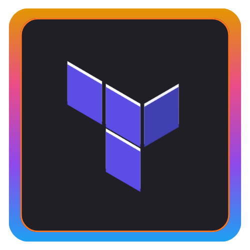

<h1 align="left">
  
  Elizabete De Sousa Fabri
</h1>

  <b>Software Engineer | Platform Engineering | DevSecOps | Cloud & Front-End</b> 
  <i style="color:#999;">Passionate about technology, automation, and Cloud solutions ☁️</i>

### 🌸 About Me

I’m a **Software Engineer at Itaú Unibanco**, passionate about technology, automation, and Cloud-native solutions.  
I work with a strong focus on **Platform Engineering, DevSecOps, and Software Engineering**, combining performance, security, and innovation.  
In my free time, I enjoy building intuitive interfaces and exploring personal projects using Angular, Next.js, and AWS.

  

### 💬 Connect with Me

  
  
  
  
  

  

### ⚡ Tech Stack

  
  
  
  
  
  

  

### 🎓 Certification

  <table>
    <tr>
      <td align="center">
        
      </td>
      <td align="center">
        <a href="https://www.credly.com/users/elizabetefabri" target="_blank">
          
      </td>
      <td align="center">
        
      </td>
      <td align="center">
        
      </td>
    </tr>  
    <tr>
      <td align="center">
        
      </td>
      <td align="center">
        
      </td>
      <td align="center">
        
      </td>
      <td align="center">
        
      </td>
    </tr>
  </table>

  

### 🎓 Academic Background

#### 📘 Postgraduate Studies

- **Artificial Intelligence and Machine Learning**  
  _Completed — 2024 • 2025_

- **Cybersecurity**  
  _In progress — 2025 • 2026_

#### 🎓 Undergraduate Degree

- **Internet Systems**  
  _Completed — 2019 • 2022_

  

### 📊 GitHub Analytics

<table>
<tr>
<td align="center">

**Stats**

</td>
<td align="center">

**Top Languages**

</td>
</tr>

<tr>
<td colspan="2" align="center">

**Activity Graph**

</td>
</tr>
</table>

  

### 🎮 Fun Visualizations

<table align="center">
<tr>
<td align="left">
    
### 🟡 Pac-Man Graph

</td>
</tr>

<tr>
<td align="left">

### 🟡 Grid Snake

</td>
</tr>
</table>

  
  
  <i>"Nada substitui a persistência, nem mesmo o talento." — Calvin Coolidge</i>

